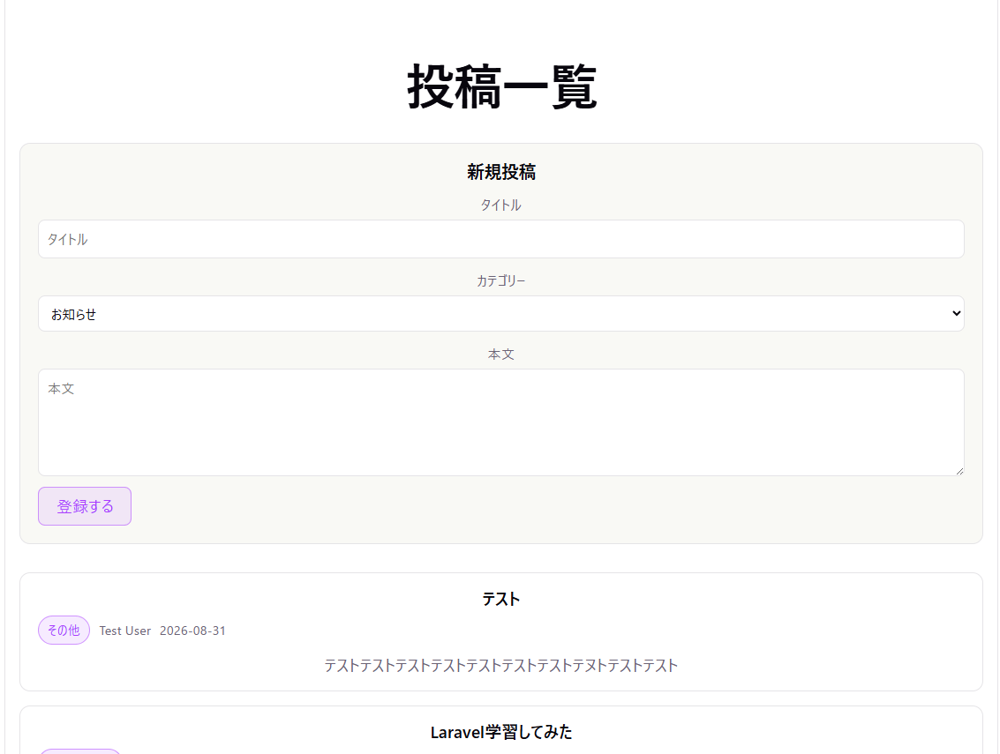

# Week 10 課題：Laravel API + React フロントエンド

Laravel（別リポジトリ）を API 化し、React から `axios` で呼び出して投稿を一覧表示・新規登録する。

- フロントエンド: このリポジトリ（Vite + React）
- バックエンド: `[laravel-docker-app](https://github.com/aoleaf/techmeets-month2)`（別リポジトリ）

実装手順は [WEEK10_GUIDE.md](WEEK10_GUIDE.md) にまとめてある。

---

## 動かし方

### 1. バックエンド（Laravel）

```bash
cd <laravel-docker-app のパス>
docker compose up -d
docker compose exec app php artisan migrate --seed
```

`http://localhost/api/posts` を開いて JSON が返ればOK。

### 2. フロントエンド（React）

```bash
cd my-frontend
cp .env.example .env      # APIのURLを設定（デフォルト: http://localhost/api）
npm install
npm run dev
```

`http://localhost:5173` を開く。


---

## 使用しているAPI

ベースURL: `http://localhost/api`（Docker の nginx が 80番のため、ポート指定なし）

| メソッド | パス | 説明 | 成功時 |
|---|---|---|---|
| GET | `/api/posts` | 投稿一覧（1ページ10件） | 200 |
| GET | `/api/posts/{id}` | 投稿1件 | 200 / 404 |
| POST | `/api/posts` | 投稿の新規作成 | 201 / 422 |

レスポンスは `App\Http\Resources\PostResource` で整形しており、返すフィールドは以下に限定している。
モデルをそのまま返さないことで、DBに列が増えても意図しない値が外に出ない。

| フィールド | 型 | 備考 |
|---|---|---|
| `id` | int | |
| `title` | string | |
| `content` | string | |
| `category` | string | |
| `author` | string \| null | `Post -> belongsTo(User)` 経由で取得した投稿者名 |
| `created_at` | string | `Y-m-d` 形式に整形 |

### GET /api/posts

`paginate(10)` を使っているため、`data`（投稿の配列）に加えて `links` / `meta` が付く。
フロントは `response.data.data` を読んで一覧に渡している。

```json
{
  "data": [
    {
      "id": 16,
      "title": "Laravel学習してみた",
      "content": "Laravelの書き方を習得するために、イベント投稿サイトを作成した",
      "category": "プログラミング",
      "author": "Test User",
      "created_at": "2026-08-11"
    }
  ],
  "links": { "first": "...", "last": "...", "prev": null, "next": "..." },
  "meta": { "current_page": 1, "last_page": 2, "per_page": 10, "total": 16 }
}
```

### GET /api/posts/{id}

1件なので `data` の中身はオブジェクト。存在しないIDはルートモデルバインディングにより 404。

```json
{ "data": { "id": 16, "title": "...", "content": "...", "category": "...", "author": "Test User", "created_at": "2026-08-11" } }
```

### POST /api/posts

リクエストボディ（`App\Http\Requests\PostRequest` で検証）:

| 項目 | 必須 | ルール |
|---|---|---|
| `title` | ○ | 文字列 / 200文字以内 |
| `content` | ○ | 文字列 |
| `category` | ○ | 文字列 / 50文字以内 |

```json
{ "title": "はじめての投稿", "content": "本文", "category": "技術" }
```

成功時は **201** で作成された1件を返す。
検証に失敗すると **422** で項目ごとのエラーが返るので、フロントはこれをフォームの各項目の下に表示している。

```json
{
  "message": "タイトル field is required. (and 2 more errors)",
  "errors": {
    "title": ["タイトル field is required."],
    "content": ["本文 field is required."],
    "category": ["カテゴリー field is required."]
  }
}
```

> リクエストに `Accept: application/json` を付けているため、検証失敗時に
> HTMLへのリダイレクトではなく上記のJSONが返る（`src/api/client.js` で設定済み）。

---

## コンポーネント分割の理由

```
App
├── PostForm   新規登録フォーム
└── PostList   一覧全体
    └── PostCard   1件分のカード × 件数分
```
PostCard と PostList は API を呼ばず、親から受け取った props を表示するだけのコンポーネントとして役割を限定しているため、再利用性が高くなり、変更点や不具合の原因も切り分けやすくなる。投稿データ（posts）の state は、フォームで新規投稿した際に一覧へ即反映させる必要があるため、兄弟コンポーネント間では直接データを共有できない構造上、親コンポーネントである App が一元管理する形が適している。一方で、入力中の文字は確定するまで他のコンポーネントが参照する必要がないため、PostForm 内だけで state を持たせることで責務を明確に分離し、全体として扱いやすい構成になっている。

---

## 補足・既知の制約

- API の `POST /api/posts` は、投稿の作者として「最初のユーザー」を固定で使っている。
  SPA からのログイン（Laravel Sanctum）は Week 10 のスコープ外のため。

---

## スクリーンショット
  
